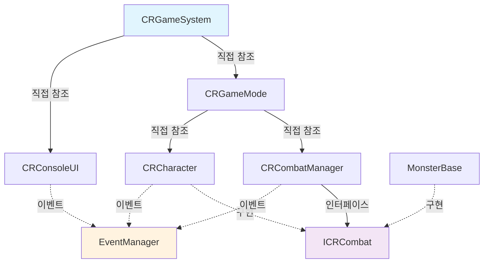

# ConsoleRPG 프로젝트 분석 보고서

## 슬라이드 1: 프로젝트 개요
### 프로젝트 소개
- **프로젝트명**: ConsoleRPG
- **개발 언어**: C++
- **프로젝트 유형**: 콘솔 기반 턴제 RPG 게임
- **주요 특징**: 
  - 객체지향 설계 원칙 적용
  - 다양한 디자인 패턴 활용
  - 이벤트 기반 아키텍처
  - 모듈화된 시스템 구조

---

## 슬라이드 2: 의존성 역전 원칙 (DIP) 적용
### 상위 → 하위: 직접 참조, 하위 → 상위: 인터페이스 참조
```cpp
// 상위 레벨에서 하위 레벨로 직접 참조
class CRGameSystem {
    unique_ptr<ICRGameMode> GameMode;        // 인터페이스 참조
    unique_ptr<CRConsoleUI> GameConsoleUI;   // 구체 클래스 직접 참조
};

class CRGameMode : public ICRGameMode {      // 인터페이스 구현
    shared_ptr<CRCombatManager> CombatManager;  // 구체 클래스 직접 참조
    shared_ptr<CRCharacter> PlayerCharacter;    // 구체 클래스 직접 참조
};

class CRCombatManager {
    vector<shared_ptr<ICRCombat>> CombatSequence;  // 인터페이스 참조
};
```

### 의존성 방향과 통신 방식


### DIP 적용의 장점
- **상위 모듈 안정성**: 하위 구현 변경에 영향받지 않음
- **테스트 용이성**: 인터페이스를 통한 Mock 객체 주입 가능
- **확장성**: 새로운 구현체 추가 시 기존 코드 수정 불필요

---

## 슬라이드 3: 전체 아키텍처 구조
### 시스템 계층 구조
```
CRGameSystem (최상위 관리자)
    ├── CRGameMode (게임 로직 관리)
    ├── CRConsoleUI (사용자 인터페이스)
    └── CRCombatManager (전투 시스템)
```

### 핵심 시스템 구성요소
- **게임 시스템**: 전체 생명주기 관리
- **전투 시스템**: 턴제 전투 로직
- **캐릭터 시스템**: 플레이어/몬스터 관리
- **인벤토리 시스템**: 아이템 관리
- **UI 시스템**: 콘솔 기반 인터페이스

---

## 슬라이드 4: 적용된 디자인 패턴 - Singleton 패턴
### Thread-Safe Singleton 구현
```cpp
template <typename T>
class Singleton {
private:
    inline static std::unique_ptr<T> instance = nullptr;
    inline static std::once_flag initFlag;
public:
    static T& GetInstance() {
        call_once(initFlag, []() { 
            instance = std::make_unique<T>();
        });
        return *instance;
    }
};
```

### 장점 및 활용
- **Thread-Safe**: `std::call_once` 사용으로 멀티스레드 환경에서 안전
- **메모리 효율성**: `unique_ptr`로 자동 메모리 관리
- **전역 접근**: EventManager, ConsoleRenderer 등에 활용
- **복사/이동 방지**: 명시적으로 삭제하여 안전성 보장

---

## 슬라이드 5: 적용된 디자인 패턴 - Observer 패턴 (Event System)
### 템플릿 기반 이벤트 매니저
```cpp
template<typename... Args>
class CREventManager {
    using Callback = function<void(Args...)>;
    unordered_map<EEventType, vector<Listener>> listeners;

    ListenerID Subscribe(const EEventType& eventName, Callback callback);
    void Broadcast(const EEventType& eventName, Args... args);
};
```

### 시스템 간 느슨한 결합
- **타입 안전성**: 템플릿으로 컴파일 타임 타입 체크
- **유연한 매개변수**: 가변 템플릿으로 다양한 이벤트 타입 지원
- **자동 구독 해제**: ListenerID를 통한 안전한 구독 관리
- **모듈 간 독립성**: 직접 참조 없이 통신 가능

---

## 슬라이드 6: 적용된 디자인 패턴 - Factory 패턴
### 몬스터 팩토리 구현
```cpp
class CRMonsterFactory {
public:
    static std::shared_ptr<MonsterBase> CreateMonster(EMonsterType type, int level, int uniqueId);
    static std::shared_ptr<MonsterBase> CreateMonsterByLevel(int level, int uniqueId);
private:
    static const std::vector<LevelRange> LevelMappings;
};
```

### 레벨 기반 동적 생성
- **확장성**: 새로운 몬스터 타입 쉽게 추가 가능
- **레벨 매핑**: 게임 진행도에 따른 적절한 몬스터 생성
- **예외 처리**: 메모리 할당 실패 및 잘못된 매개변수 처리
- **람다 활용**: LevelRange에서 함수 포인터로 유연한 생성 로직

---

## 슬라이드 7: 적용된 디자인 패턴 - Strategy 패턴
### 아이템 시스템 구현
```cpp
class CRItem {
public:
    virtual void use(CRCharacter* character) = 0;
    virtual string getName() const = 0;
};

// 구체적인 전략들
class CRHealthPotion : public CRItem { /* 체력 회복 전략 */ };
class CRAttackBoost : public CRItem { /* 공격력 증가 전략 */ };
```

### 다형성을 통한 유연성
- **런타임 동작 변경**: 아이템 타입에 따른 다른 효과
- **코드 재사용성**: 공통 인터페이스로 일관된 처리
- **확장 용이성**: 새로운 아이템 효과 쉽게 추가
- **캡슐화**: 각 아이템의 고유 로직 독립적 관리

---

## 슬라이드 8: 메모리 관리 및 스마트 포인터 활용
### 현대적 C++ 메모리 관리
```cpp
// shared_ptr 활용
shared_ptr<CRCombatManager> CombatManager;
shared_ptr<CRCharacter> PlayerCharacter;
shared_ptr<CRInventory> Inventory;

// unique_ptr 활용
unique_ptr<ICRGameMode> GameMode;
unique_ptr<CRConsoleUI> GameConsoleUI;
unique_ptr<vector<shared_ptr<ICRCombat>>> CombatSequence;
```

### 메모리 안전성 보장
- **자동 메모리 관리**: RAII 원칙 적용
- **소유권 명확화**: unique_ptr vs shared_ptr 적절한 선택
- **순환 참조 방지**: 적절한 포인터 타입 선택으로 메모리 누수 방지
- **예외 안전성**: 스마트 포인터로 예외 발생 시에도 안전한 정리

---

## 슬라이드 9: 다형성을 통한 통합 전투 시스템
### ICRCombat 인터페이스 기반 설계
```cpp
// 공통 전투 인터페이스
class ICRCombat {
    virtual void Act() = 0;
    virtual void TakeDamage(int value) = 0;
    virtual void Attack() = 0;
    virtual int GetUniqueId() = 0;
    virtual EUnitStatus GetUnitStatus() = 0;
};

// Character와 Monster 모두 동일한 인터페이스 구현
class CRCharacter : public ICRCombat { /* 플레이어 구현 */ };
class MonsterBase : public IMonster, public ICRCombat { /* 몬스터 구현 */ };
```

### CombatManager에서의 통합 처리
```cpp
class CRCombatManager {
    unique_ptr<vector<shared_ptr<ICRCombat>>> CombatSequence;

    void CombatStart() {
        for (auto& unit : *CombatSequence) {
            if (unit->GetUnitStatus() == EUnitStatus::EUS_Alive) {
                unit->Act();  // 다형성으로 각자의 행동 실행
            }
        }
    }
};
```

### 다형성의 장점
- **타입 통합**: Character와 Monster를 동일한 컨테이너에서 관리
- **코드 단순화**: 타입별 분기 처리 없이 일관된 로직
- **확장성**: 새로운 전투 유닛 타입 쉽게 추가
- **런타임 다형성**: 각 객체의 실제 타입에 따른 적절한 메서드 호출

---

## 슬라이드 10: 현대적 C++ 기법 활용
### 람다 함수와 함수형 프로그래밍
```cpp
// 팩토리에서 람다 함수 활용
const std::vector<LevelRange> CRMonsterFactory::LevelMappings = {
    {1, 2, [](int level, int uniqueId) { return std::make_shared<Slime>(level, uniqueId); }},
    {3, 5, [](int level, int uniqueId) { return std::make_shared<Goblin>(level, uniqueId); }},
    // ...
};

// 이벤트 시스템에서 람다와 std::bind 활용
call_once(initFlag, []() {
    instance = std::make_unique<T>();
});

// 이벤트 구독에서 std::bind 사용
bind(&CRCharacter::Attack, this)
bind(&CRInventory::CreateItem, this, placeholders::_1)
```

### constexpr와 컴파일 타임 최적화
```cpp
class MonsterBase {
private:
    static constexpr int DEFAULT_HEALTH = 100;
    static constexpr int DEFAULT_DAMAGE = 10;
    static constexpr EMonsterAttribute DEFAULT_ATTRIBUTE = EMonsterAttribute::EMA_None;
};
```

### 현대적 C++ 기법의 장점
- **람다 함수**: 간결한 함수 객체 생성, 클로저 활용
- **constexpr**: 컴파일 타임 상수로 런타임 성능 향상
- **std::bind**: 유연한 함수 바인딩과 부분 적용
- **std::clamp**: 안전한 값 범위 제한

---

## 슬라이드 11: 칭찬할 만한 설계 특징
### 1. 모듈화된 시스템 구조
- **관심사 분리**: 각 클래스가 명확한 단일 책임
- **느슨한 결합**: 이벤트 시스템으로 모듈 간 독립성 확보
- **높은 응집도**: 관련 기능들이 적절히 그룹화

### 2. 확장성 고려
- **팩토리 패턴**: 새로운 몬스터/아이템 타입 쉽게 추가
- **템플릿 활용**: 타입 안전성과 재사용성 동시 확보
- **인터페이스 기반**: 새로운 구현체 추가 용이

### 3. 안전성 중시
- **예외 처리**: 메모리 할당 실패, 잘못된 입력 등 처리
- **타입 안전성**: 템플릿과 강타입 시스템 활용
- **메모리 안전성**: 스마트 포인터로 자동 메모리 관리

---

## 슬라이드 12: 개선 제안사항
### 현재 구조의 장점 유지하면서 개선 가능한 부분
1. **Command 패턴 도입**: 사용자 입력 처리를 더 체계적으로 관리
2. **State 패턴 활용**: 게임 상태(메뉴, 전투, 상점 등) 관리 개선
3. **Template Method 패턴**: 캐릭터 클래스(Warrior, Mage, Rogue)의 공통 행동 패턴화
4. **Configuration 시스템**: 하드코딩된 값들을 설정 파일로 분리

### 캐릭터 상속 구조 활용 개선
```cpp
// 현재: 단순 상속
class CRWarrior : public CRCharacter { void specialMove(); };
class CRMage : public CRCharacter { void castSpell(); };
class CRRogue : public CRCharacter { void stealthAttack(); };

// 개선 제안: Template Method 패턴
class CRCharacter {
    void performSpecialAbility() { // Template Method
        prepareAbility();
        executeAbility(); // 하위 클래스에서 구현
        finishAbility();
    }
    virtual void executeAbility() = 0;
};
```

### 학습 가치
- **실무 적용 가능한 패턴들**: 실제 게임 개발에서 자주 사용되는 패턴들
- **현대적 C++ 활용**: C++11/14/17 기능들의 적절한 활용
- **아키텍처 설계**: 확장 가능하고 유지보수 가능한 구조 설계

---

## 슬라이드 13: 결론
### 프로젝트의 교육적 가치
- **디자인 패턴 실습**: 이론을 실제 코드로 구현
- **객체지향 설계**: SOLID 원칙의 실제 적용 사례
- **현대적 C++**: 스마트 포인터, 템플릿 등 활용법 학습
- **시스템 아키텍처**: 모듈화된 게임 시스템 설계 경험

### 실무 연결성
- **게임 개발**: 실제 게임 엔진에서 사용되는 패턴들
- **소프트웨어 아키텍처**: 확장 가능한 시스템 설계 원칙
- **팀 개발**: 모듈 간 독립성으로 협업 효율성 향상
